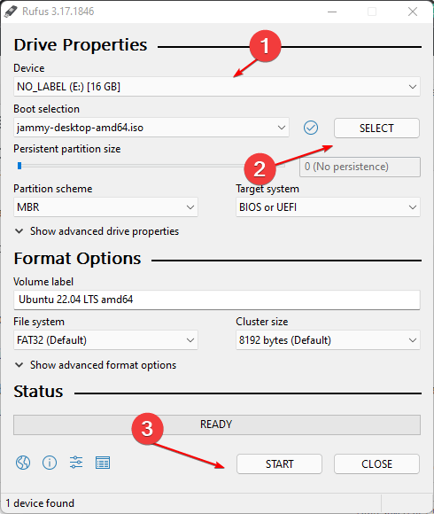
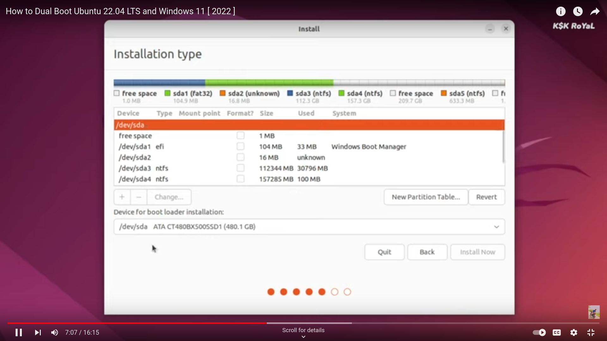
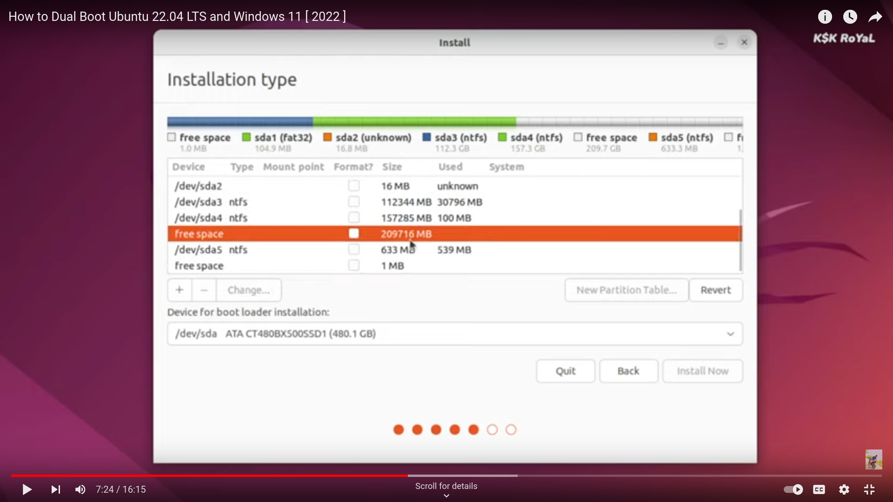
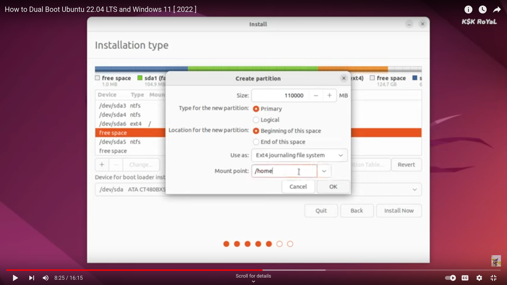

# **Ubuntu Installation**

- Hard Drive Partition
- Requirements
- Installation

## **Hard Drive Partition**

  1.  In windows 11 search bar type `computer management` and type enter (a window will be opened).
  2.  Select `Disk Management` from `Storage` section.
  3.  Click on the largest partition(In new laptop mostly like C Drive) and click on `shrink volume` (A dialog box will appear)
  4.  Enter **200000** (Four lakh MB = 200GB) in the input with label `Enter the amount of space to shrink in MB`
  5. Click on Shrink (200 GB of empty partition will be created)
  6. Right click on newly created 200GB space 
  7. Select new simple volume
  8. Click next (leave the values as default)
  9. Click next (remember the value in drop down, most likely **E** drive)
  10. Click next
  11. Click Finish

## **Requirements**

  - Pendrive with minimum 8 GB memory.
(preferably empty pendrive, Data will be erased in pendrive while making bootable USB)

  - Ubuntu ISO File (click this link to download)
[ubuntu-22.04.1-desktop-amd64.iso](https://releases.ubuntu.com/22.04/ubuntu-22.04.1-desktop-amd64.iso)

  - Rufus (click this link to download) [download rufus](https://github.com/pbatard/rufus/releases/download/v3.20/rufus-3.20.exe)

## **Installation**
### **Burning OS into USB/ Creating bootable USB** 
0. Install the Rufus and attach the USB to laptop
1. Select the USB drive attached to your system that you want to use.
2. Choose the downloaded ISO file of Jammy JellyFish.
3. After that simply click on the Start button. For more clear idea see the below screenshot.

4. Wait until it the process completes.(takes upto 15 mins)

### **Booting the OS**

restart the device and click `ESC` during several times startup and selecting the USB device from the system-specific boot menu.

press **F10** to go to `BIOS`

Go to `system configuration` section (use arrow keys)

Set the `Intel Rapid Start Technology` is **Disabled** (use arrow key and enter key to change the option)

Go to `boot` section (use arrow keys)
Set the `USB Boot` **Enabled**

save the changes (You will find a key to save the changes in bottom/side menu)

The computer will start booting,Now press ESC for 6-10 times.
(Alternative: restart the computer and press ESC for 6-10 times if you missed the above step)

select **F9** to go to `Boot Menu`

Use arrow key to select USB

Now, You will see a window with two options
1. Try Ubuntu
2. Install Ubuntu

Select `Install Ubuntu`

**Language selection**

Select English as default language(English is pre-selected), click next.

**Updates and other software section**

select normal installation 
select download updates while installing ubuntu(in Other Options)
select Install third party software for graphics and wifi hardware

**Installation type**

select `something else` option

you will see the internal disk of 512 GB at bottom

(like 480.1 GB in the picture)

scroll the list until you find largest free space about 200 GB and click on it.(as in below pic)
_**Do not modify any other partitions**_

click on the plus button(Just above device for boot loader installation)

from the 200 GB of free space create a partition
allocate 85 GB to root
  - Give Size as 85000 
  - Use as Ext4 journaling file system
  - Mount point as **/** (as in pic below pic)
  - Click OK
- a new partition for root will be created (Now the free space will be decreased by 85 GB, nearly 115 GB will be remaining)

from the 115 GB of free space create another partition
allocate 100 GB to home
  - Give Size as 100000 
  - Use as Ext4 journaling file system
  - Mount point as **/home** (as in pic below pic)
  - Click OK
  - a new partition for home will created

from the 15 GB of free space create last partition
allocate 15 GB to Swap
  - Give Size as 15000 
  - Use as swap area
  - Click OK
  - a new partition for swap will created 

click **Install Now** button
click `continue` in the dialog box

**Time zone**

select Kolkata as timezone place

**Create User Account**

fill the form and remember the password(minimum of 8 letters word is preferred)

click `continue`

The installation will begin and it may take 15 to 20 minutes

After installation click `restart now` (Make sure to remove the bootable pendrive before restarting)